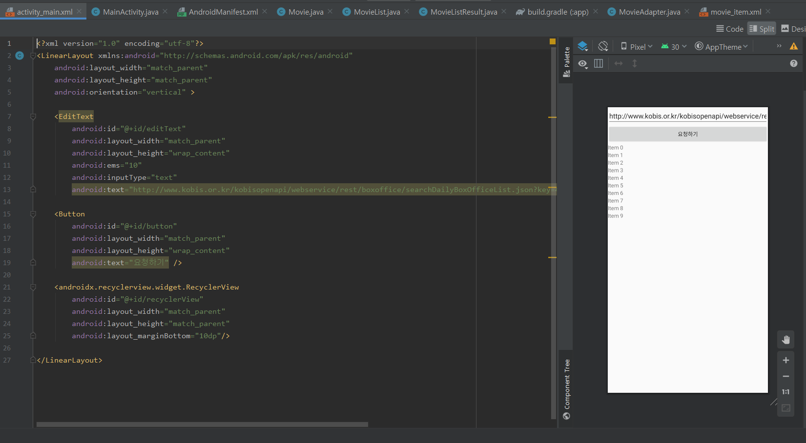
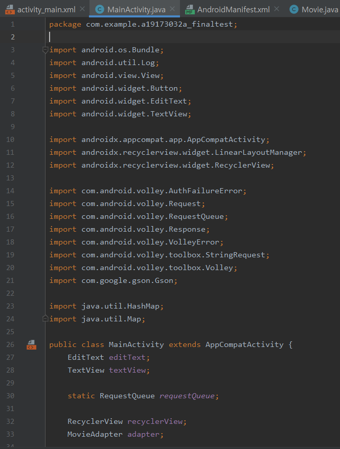
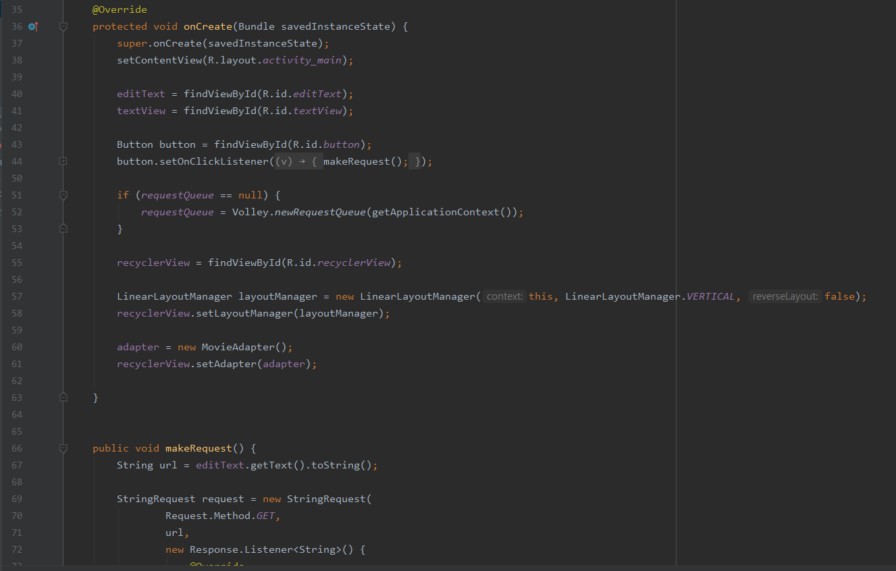
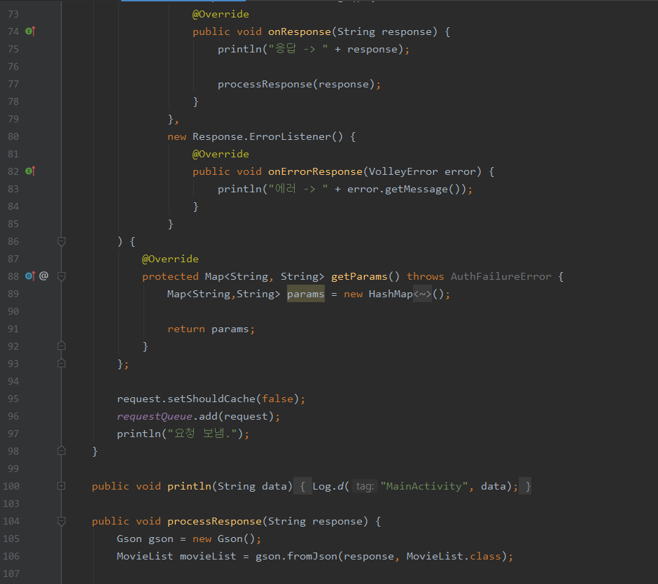
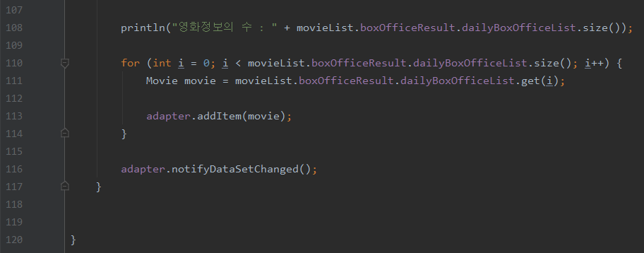

# 영화별 관객 관람 수

## 19173032A_Finaltest

## 영화별 관객 관람 수 시각화 화면

 </img>
 
## activity_main_xml 코드
 </img>
 
## MainActivity.java 코드 
</img>
</img>
 </img>
 </img>
 
## MainActivity에 사용되는 리스트 종류
## 
 
 
