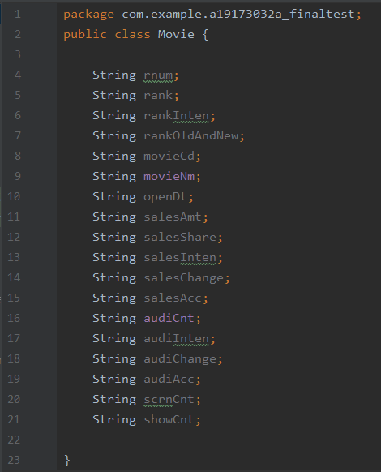
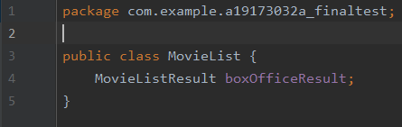
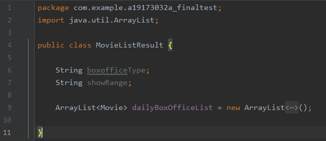
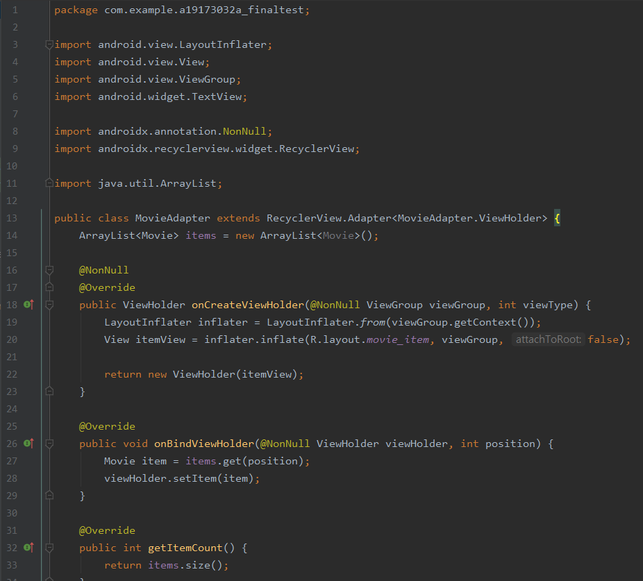
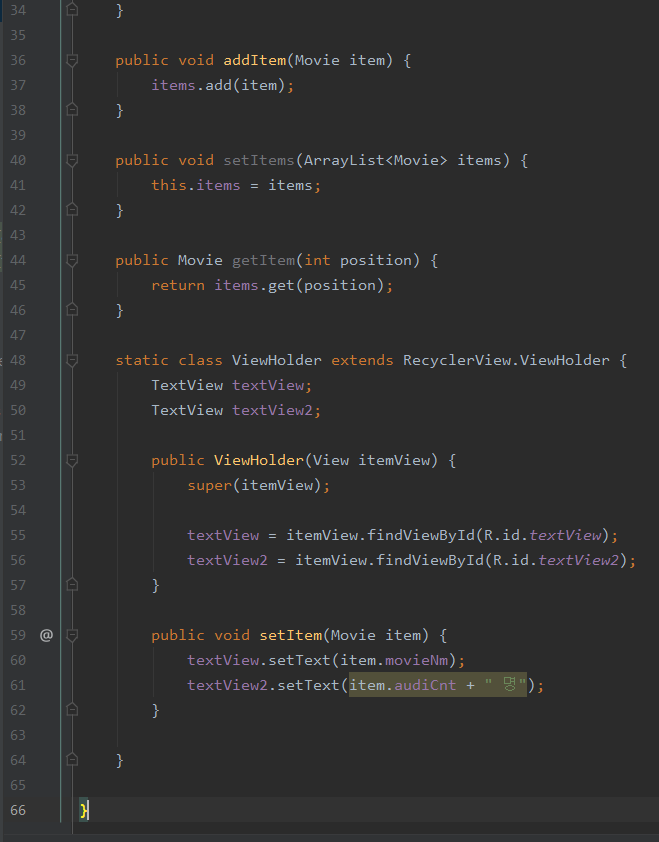

# 영화별 관객 관람 수

## 19173032A_Finaltest

## 영화별 관객 관람 수 시각화 화면

 </img>
 
## activity_main_xml code
 </img>
 
## MainActivity.java code 
</img>
</img>
 </img>
 </img>
 
## MainActivity에 사용되는 리스트
## 1)Movie.java code
 </img>
 
 ## 2)MovieList.java code
 </img>
 
 ## 3)MovieListResult.java code
 </img>
 
 ## 4)MovieAdapter.java code
 </img>
 </img>
